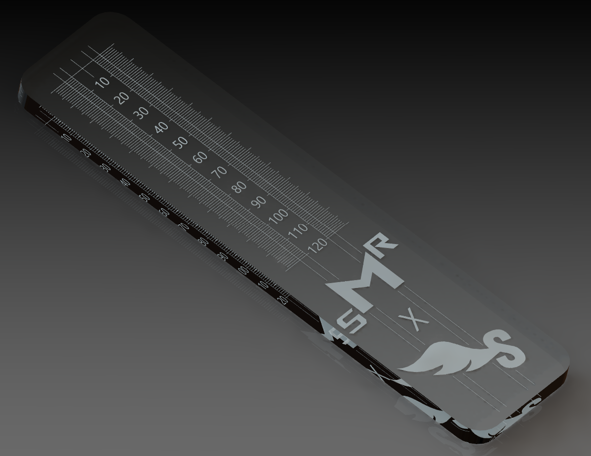

# Speed x SMR glass gauge

Glass gauge used with feeler gauge set to measure the facing curve on mouthpieces this gauge use 0.5mm scale (if the facing is 20mm the gauge will read 40) when reading mouthpiece facing numbers this is the scale that usually referred to

#

# Tools

- laser engraver (Fiber Laser recommend)

# BOM

| Qty | Component                                                                                           |
| --- | --------------------------------------------------------------------------------------------------- |
| 1   | 5mm thick 30mm x 120mm low iron glass (5mm rounded coners *not necessary) (tempered *not recommend) |
| 1   | microfiber cloths                                                                                   |
| 1   | car wash sponge                                                                                     |
| 1   | 99% isopropyl alcohol                                                                               |
| 1   | matte black spray paint                                                                             |
| 1   | paint remover spray                                                                                 |
| 1   | glass etching cream                                                                                 |

# Build instruction

- clean the glass with ipa and microfiber cloths
- spray the spray paint on one side of the glass
- wait untill it was dry
- leser the painted side of the glass with the engraver using this [file](./Leser_file/)
- Apply glass etching cream to the gap left by the laser and follow the instructions on the box
- remove the paint with paint remover spray and sponge
- clean it with ipa and microfiber cloths

# Inspired by
- hand made glass gauge by Wirat Taksinamanee of SMR

#
You like this project? You want to support me and my work, help me bring new cool stuff to the community? Well you can buy speed official product from [saxophone siam](https://saxophonesiam.com/)

Copyright (c) 2022 Tanatorn Pravalpadd under [CERN-OHL-S](/LICENSE.txt) license